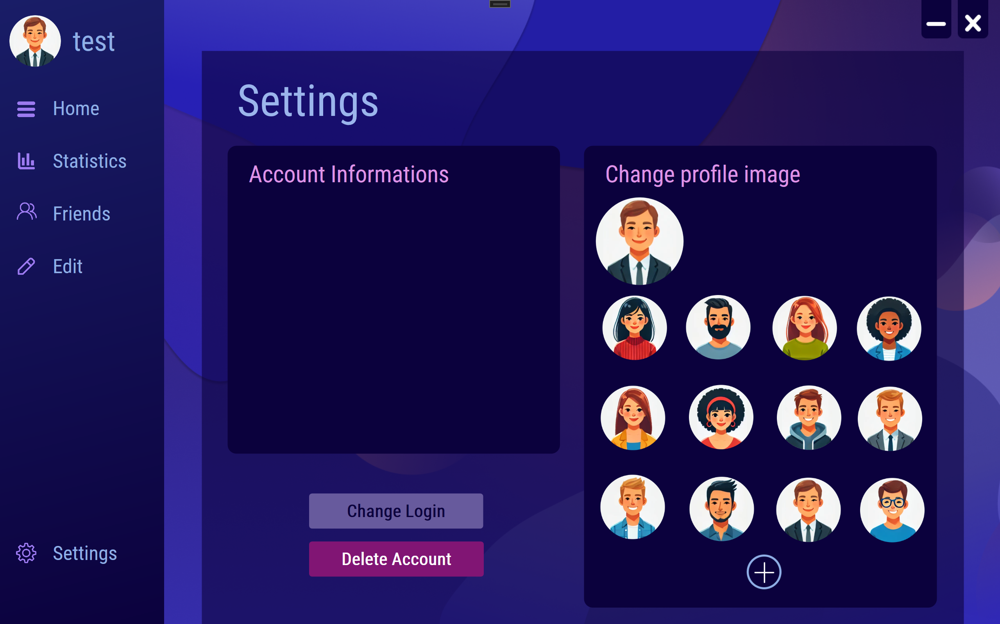

# Quizzy

## Overview
Quizzy is a Windows Presentation Foundation (WPF) desktop application designed to offer an engaging and interactive quiz experience. Users can register, log in, customize their profiles, and participate in quizzes with a variety of features tailored for personalization and learning.

## Features
- **User Registration and Login**: Secure user registration using email and password. Login functionality supports both email and username.
- **User Authentication**: Utilizes SQL Server for secure storage and authentication of user credentials.
- **Customizable Profiles**: Users can upload a custom avatar or select one from a set of predefined avatars.
- **Animated Panels**: Smooth transitions between login, registration, and other panels using animations.
- **Password Validation**: Strong password policies, requiring at least one uppercase letter, one special character, and a length between 6 and 15 characters.
- **Quiz Management**: Create, edit, and delete quizzes, with the ability to upload custom images and provide detailed quiz descriptions.
- **Dynamic Content Loading**: Load quizzes dynamically from JSON files or Azure Blob Storage.
- **User-Specific Settings**: Save and restore user settings, including avatars and progress, across sessions.
- **Responsive UI**: Modern and user-friendly interface with support for animations and dynamic data binding.
- **Azure Blob Storage Integration**: Supports uploading, downloading, and managing quiz data and user files using Azure Blob Storage APIs.

## Technologies Used
- **.NET Framework** and **WPF** for the desktop application.
- **C#** for the application logic.
- **SQL Server** for database management.
- **Azure Blob Storage** for quiz and user data storage.
- **XAML** for the user interface layout and design.
- **Newtonsoft.Json** and **System.Text.Json** for JSON parsing.

## Application Structure
### Key Files
- **App.xaml.cs**: Contains global application logic, including user authentication and global settings.
- **MainScreen.xaml.cs**: The main interface for managing quizzes, user settings, and navigation.
- **StartScreen.xaml.cs**: Handles login and registration functionalities with animations.
- **ChangeLoginWindow.xaml.cs**: Allows users to change their login credentials securely.
- **ChangePasswordWindow.xaml.cs**: Implements password change functionality with validation.
- **DeleteWindow.xaml.cs**: Provides account deletion features.
- **BlobController.cs**: Handles interactions with Azure Blob Storage, such as uploading, downloading, and managing blobs.
- **ContainerController.cs**: Manages Azure Blob Storage containers, including creation and deletion.
- **ChangeUserInfo.cs**: Provides APIs for updating user login, password, and avatar.
- **DeleteInfo.cs**: API endpoint for securely deleting user accounts.
- **GetUserId.cs**: Retrieves user IDs based on email or login.
- **GetUserInfo.cs**: Fetches user details such as email, login, and avatar.

### Folder Structure
- `Resources/MainScreen/Avatars`: Contains predefined avatar images.
- `Resources/Quizzes`: Default resources for quizzes.
- `Resources/SideBar`: Resources for the sidebar UI.
- `AppData/Quizzy`: Stores user-specific quiz data locally.

## How to Run
1. Clone the repository.
2. Install **.NET Framework 4.7.2** or higher.
3. Set up a SQL Server database and update the `App.config` file with the connection string.
4. Configure Azure Blob Storage settings in the application configuration.
5. Build and run the project in **Visual Studio 2019** or later.

## Dependencies
- **Microsoft.Win32**: For file system interactions.
- **System.Data.SqlClient**: For database operations.
- **Azure.Storage.Blobs**: To manage Azure Blob Storage.
- **Newtonsoft.Json**: For JSON operations.

## Setup Instructions
1. Open the solution file in Visual Studio.
2. Replace placeholders in the `App.config` file with appropriate database connection details.
3. Configure Azure Blob Storage settings.
4. Run the project via Visual Studio’s debug mode (`F5`).

## Key Functionalities
### User Registration and Login
- Implements secure user authentication via SQL Server.
- Passwords are hashed using SHA256 during registration.

### Quiz Management
- Users can create, edit, delete, and manage quizzes dynamically.
- Quiz data is stored locally in JSON files and can be uploaded/downloaded from Azure Blob Storage.

### Custom Avatars
- Users can upload custom avatars or select from predefined options.
- Avatars are saved as byte arrays in the database and displayed using dynamic image binding.

### Azure Blob Storage Integration
- Users can upload and download quizzes, avatars, and other files.
- The application includes APIs for creating and managing containers and blobs in Azure Blob Storage.

### Animated Panels
- Smooth transitions between panels using XAML storyboards for `FadeIn` and `FadeOut` effects.

## Screenshots
- **Login Screen**: 
- **Registration Screen**: 
- **Quiz Management**: 
- **Settings Screen**: 

## Contributing
Contributions are welcome! Follow these steps:
1. Fork the repository.
2. Create a feature branch for your changes.
3. Submit a pull request with a clear explanation of your modifications.

## License
This project is licensed under the MIT License. Feel free to use, modify, and distribute it as needed.

## Contact
For questions or feedback, please contact via GitHub Issues or the provided contact details in the repository.

